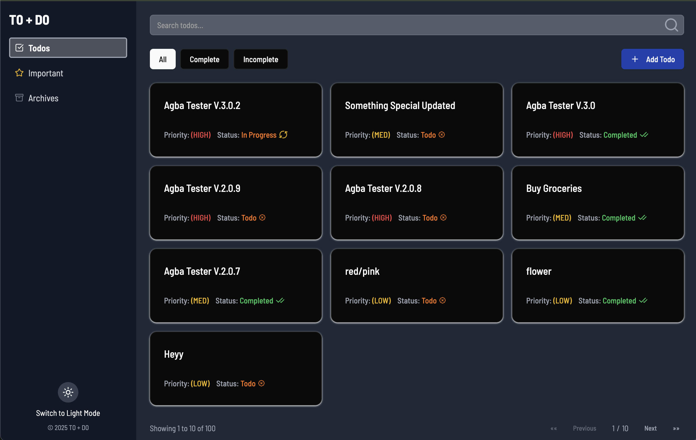

# TO+DO

A comprehensive Todo application built with React, TanStack Router, React Query(@tanstack), Tailwind CSS, and Supabase authentication. It allows users to manage tasks with features such as user authentication, pagination, search, filtering, priority levels, archiving, offline capability and full CRUD operations against a custom todo API.

---



---

## Features

### Authentication & User Management
* **User Authentication**: Email/password and Google OAuth sign-in
* **User Registration**: Account creation with name collection
* **Protected Routes**: Secure access to todo functionality
* **User Profile Display**: Name and email shown in sidebar
* **Session Management**: Persistent login state with auto-refresh
* **Landing Page**: App info page for new visitors

### Todo Management
* **Todo Listing** with client-side pagination (10 items per page)
* **Search & Filter**: search by title and filter by status (All, Completed, Incomplete)
* **Priority Levels**: Low, Medium, High
* **Important View**: lists only high-priority tasks
* **Archived View**: lists archived tasks
* **Todo Detail**: view details of a single task
* **Create, Update & Delete** todos via modal forms

### Technical Features
* **Theme Toggle**: light and dark mode support
* **Error Handling**: custom 404 page and Error Boundary
* **Cache API responses** using localStorage (localforage)
* **Offline capability** with IndexedDB (Dexie.js)
* **Responsive Design**: mobile-first, accessible UI
* **PWA Support**: Progressive Web App capabilities

---

## Installation & Setup

1. Clone the repository:

   ```bash
   git clone <your-repo-url>
   cd todo-app
   ```

2. Install dependencies:

   ```bash
   npm install
   ```

3. Set up environment variables:
   Create a `.env` file in the root directory:

   ```env
   VITE_SUPABASE_URL=your_supabase_url
   VITE_SUPABASE_ANON_KEY=your_supabase_anon_key
   ```

4. Run the development server:

   ```bash
   npm run dev
   ```

5. Open your browser at `http://localhost:5173`

---

## Available Scripts

* `npm run dev` - start development server
* `npm run build` - build production assets
* `npm run preview` - preview production build

---

## Technology Stack & Architecture

### Frontend
* **React 19+**: functional components and hooks
* **TanStack Router**: client-side routing with protected routes
* **React Query/Axios**: data fetching & caching
* **Tailwind CSS** + **shadcn/ui**: utility-first styling & UI components
* **lucide-react**: icon library
* **Tanstack Form**: form state management
* **Vite**: build tooling for fast HMR

### Backend & Authentication
* **Supabase**: Backend-as-a-Service for authentication and data
* **Google OAuth**: Social login integration
* **Custom API**: Todo CRUD operations with offline sync

### Data Management
* **IndexedDB (Dexie)**: Offline data storage
* **LocalForage**: Browser storage abstraction
* **Queue-based sync**: Offline operation management

The app follows a component-driven architecture with modular routes, shared UI components under `src/components`, page routes under `src/routes`, and context providers for global state management.

---

## Route Structure

### Public Routes
* `/` - Landing page with features and sign-up CTAs
* `/login` - User sign-in page
* `/register` - New user registration

### Protected Routes (requires authentication)
* `/app` - Main todo dashboard
* `/important` - High-priority tasks
* `/archived` - Archived tasks
* `/todos/:id` - Individual todo details

---

## API Documentation & Usage

The app integrates with a custom API for todos:

* **Base URL**: `https://api.oluwasetemi.dev`
* **Doc URL**: `https://api.oluwasetemi.dev/reference`

| Method | Endpoint      | Description                   |
| ------ | ------------- | ----------------------------- |
| GET    | `/tasks`      | Fetch all tasks               |
| GET    | `/tasks/{id}` | Fetch a single task by its ID |
| POST   | `/tasks`      | Create a new task             |
| PUT    | `/tasks/{id}` | Update an existing task       |
| DELETE | `/tasks/{id}` | Delete a task                 |

All endpoints support JSON request and response bodies, matching the following schema:

```json
{
  "id": "string",
  "name": "string",
  "description": null,
  "start": null,
  "end": null,
  "duration": null,
  "priority": "LOW",
  "status": "TODO",
  "archived": true,
  "parentId": null,
  "children": "string",
  "owner": null,
  "tags": null,
  "completedAt": null,
  "createdAt": null,
  "updatedAt": null
}
```

The API helpers live in `src/api/todo.jsx`.

---

## Authentication Setup

### Supabase Configuration

1. Create a new project at [supabase.com](https://supabase.com)
2. Get your project URL and anon key from Settings > API
3. Add them to your `.env` file
4. Configure authentication providers in Supabase dashboard:
   - Go to Authentication > Providers
   - Enable Email provider (enabled by default)
   - Enable Google provider and configure OAuth credentials

### Google OAuth Setup (Optional)

1. Go to [Google Cloud Console](https://console.cloud.google.com)
2. Create OAuth 2.0 credentials
3. Add authorized redirect URIs for your Supabase project
4. Add the credentials to your Supabase Google provider settings

---

## Demos

Here's the Live [URL](https://t0d0z.netlify.app/)


---

## Future Improvements

* Properly implement archiving feature
* Add toasts and notifications for better user feedback
* Customizable task durations and deadlines
* Add drag-and-drop ordering for todos
* Team collaboration features
* Advanced search and filtering options
* Email notifications for important tasks