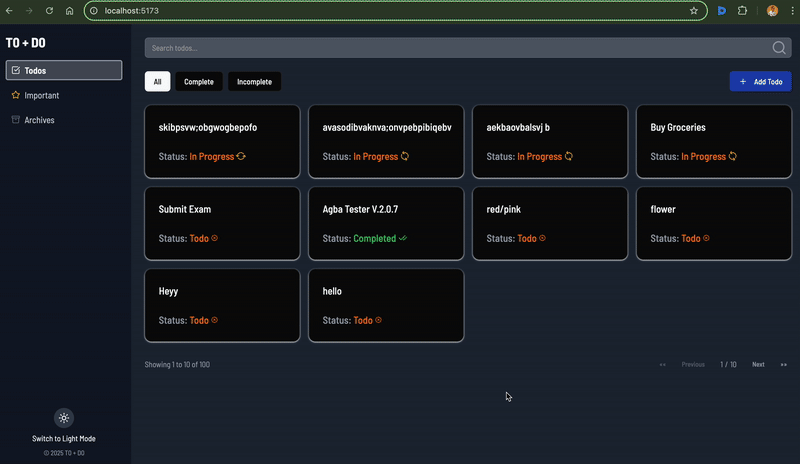
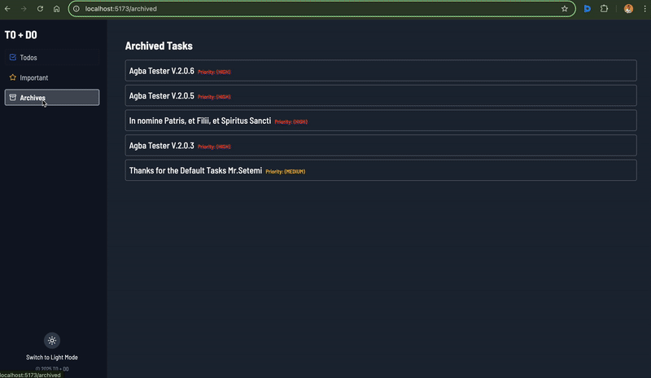
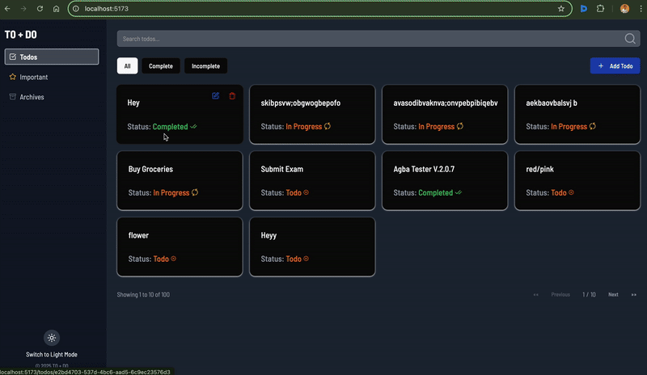
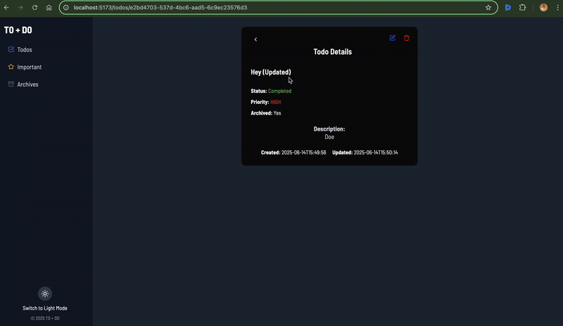

## TO+DO

A simple yet powerful Todo application built with React, TanStack Router, React Query(@tanstack), and Tailwind CSS. It allows users to manage tasks with features such as pagination, search, filtering, priority levels, archiving, and full CRUD operations against the JSONPlaceholder API.

---


---

### Features

* **Todo Listing** with client-side pagination (10 items per page)
* **Search & Filter**: search by title and filter by status (All, Completed, Incomplete)
* **Priority Levels**: Low, Medium, High
* **Important View**: lists only high-priority tasks
* **Archived View**: lists archived tasks
* **Todo Detail**: view details of a single task
* **Create, Update & Delete** todos via modal forms
* **Theme Toggle**: light and dark mode support
* **Error Handling**: custom 404 page and Error Boundary
* **Responsive Design**: mobile-first, accessible UI

---

### Installation & Setup

1. Clone the repository:

   ```bash
   git clone <your-repo-url>
   cd todo-app
   ```
2. Install dependencies:

   ```bash
   npm install
   ```
3. Run the development server:

   ```bash
   npm run dev
   ```
4. Open your browser at `http://localhost:5173`

---

### Available Scripts

* `npm run dev` - start development server
* `npm run build` - build production assets
* `npm run preview` - preview production build

---

### Technology Stack & Architecture

* **React 19+**: functional components and hooks
* **TanStack Router**: client-side routing
* **React Query/Axios**: data fetching & caching
* **Tailwind CSS** + **shadcn/ui**: utility-first styling & UI components
* **lucide-react**: icon library
* **Tanstack Form**: form state management
* **Vite**: build tooling for fast HMR

The app follows a component-driven architecture with modular routes and shared UI components under `src/components` and page routes under `src/routes`.

---

### API Documentation & Usage

The app integrates with a custom API for todos:

* **Base URL**: `https://api.oluwasetemi.dev`
* **Doc URL**: `https://api.oluwasetemi.dev/reference`

| Method | Endpoint      | Description                   |
| ------ | ------------- | ----------------------------- |
| GET    | `/tasks`      | Fetch all tasks               |
| GET    | `/tasks/{id}` | Fetch a single task by its ID |
| POST   | `/tasks`      | Create a new task             |
| PUT    | `/tasks/{id}` | Update an existing task       |
| DELETE | `/tasks/{id}` | Delete a task                 |

All endpoints support JSON request and response bodies, matching the following schema:

```json
{
  "id": "string",
  "name": "string",
  "description": null,
  "start": null,
  "end": null,
  "duration": null,
  "priority": "LOW",
  "status": "TODO",
  "archived": true,
  "parentId": null,
  "children": "string",
  "owner": null,
  "tags": null,
  "completedAt": null,
  "createdAt": null,
  "updatedAt": null
}
```

The API helpers live in `src/api/todo.jsx` .

---

### Demos






---


### Future Improvements

* Cache API responses using localStorage (localforage)
* Implement offline capability with IndexedDB (Dexie.js)
* Add user authentication, User Profile, Log In and per-user task lists
* Properly implement archiving feature
* Customizeable tast durations
* Integrate real backend API with persistent storage
* Add drag-and-drop ordering for todos
